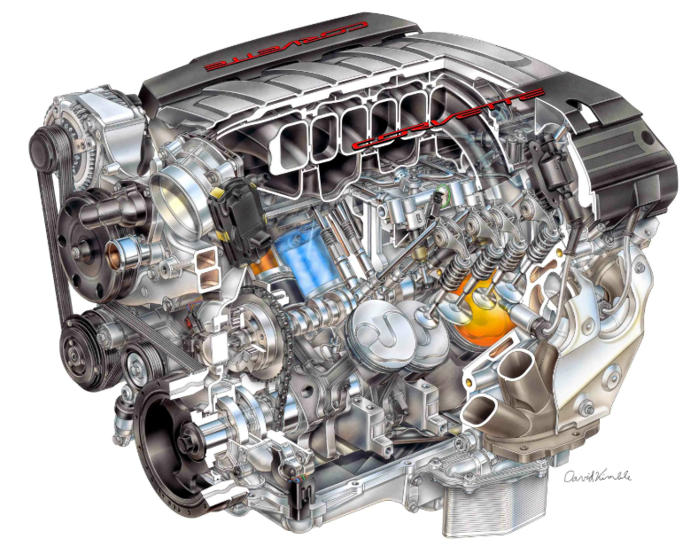

# 🚗 Документация проекта "Устройство автомобиля"

<div align="center">
  
  
  [](https://opensource.org/licenses/MIT)
  
  
  
</div>

## 📖 Техническая документация

### 🔧 Технический стек

- **Frontend:**
  - HTML5 (семантическая разметка)
  - CSS3 (переменные, анимации, flexbox, grid)
  - JavaScript (vanilla, без фреймворков)
  - Google Fonts API (шрифт Montserrat)

- **Инструменты разработки:**
  - VS Code
  - Git & github для версионного контроля
  - GitHub Pages для хостинга

### 📚 Структура кода

#### HTML-структура
```html
<!DOCTYPE html>
<html lang="ru">
<head>
    <meta charset="UTF-8">
    <meta name="viewport" content="width=device-width, initial-scale=1.0">
    <link rel="stylesheet" href="styles.css">
    <title>Устройство автомобиля</title>
</head>
<body>
    <header>...</header>
    <main>...</main>
    <footer>...</footer>
</body>
</html>
```

#### CSS-архитектура
```css
/* Переменные */
:root {
    --primary: #2c3e50;
    --secondary: #3498db;
    --text: #34495e;
    --bg: #f5f7fa;
    --accent: #e74c3c;
}

/* Базовые стили */
body {
    font-family: 'Montserrat', sans-serif;
    background: var(--bg);
    color: var(--text);
}

/* Компоненты */
.component {
    /* стили компонента */
}

/* Анимации */
@keyframes rotateBrakeDisc {
    /* кадры анимации */
}
```

### 🎨 Анимации и интерактивность

#### Двигатель
- Анимация движения поршней
- Визуализация работы ГРМ
- Эффекты искр и дыма

```css
@keyframes pistonMove {
    0% { transform: translateY(0); }
    50% { transform: translateY(50px); }
    100% { transform: translateY(0); }
}
```

#### Тормозная система
- Вращение тормозного диска
- Анимация суппорта
- Визуализация ABS

```css
@keyframes rotateBrakeDisc {
    from { transform: rotate(0deg); }
    to { transform: rotate(360deg); }
}
```

### 📱 Адаптивный дизайн

#### Медиа-запросы
```css
/* Мобильные устройства */
@media (max-width: 768px) {
    .container {
        padding: 1rem;
    }
}

/* Планшеты */
@media (min-width: 769px) and (max-width: 1024px) {
    .container {
        padding: 2rem;
    }
}

/* Десктоп */
@media (min-width: 1025px) {
    .container {
        padding: 3rem;
        max-width: 1200px;
    }
}
```

### 🔄 Оптимизация

#### Изображения
- PNG для схем и иллюстраций
- JPG для фотографий
- Оптимизация размеров и сжатие

#### Производительность
- Минимизация CSS и JavaScript
- Оптимизация анимаций
- Lazy loading для изображений

### 📂 Файловая структура

```
car-education-site/
├── index.html              # Главная страница
├── pages/                  # Страницы разделов
│   ├── engine.html
│   ├── transmission.html
│   ├── chassis.html
│   ├── electrical.html
│   └── brakes.html
├── css/
│   └── styles.css         # Основные стили
├── js/
│   └── animations.js      # Скрипты анимаций
└── img/                   # Изображения и графика
    ├── engine/
    ├── transmission/
    ├── chassis/
    ├── electrical/
    └── brakes/
```

### 💻 Требования к окружению

#### Браузеры
- Chrome/Edge ≥ 90
- Firefox ≥ 88
- Safari ≥ 14

#### Разработка
- Node.js ≥ 14.0.0
- Git ≥ 2.0.0


### 🔄 CI/CD

#### GitHub Pages
1. Настройка в репозитории:
   - Settings → Pages
   - Source: main branch
   - Folder: / (root)

2. Автоматическое развертывание при push в main


## 📄 Лицензия

Проект распространяется под лицензией MIT. Подробности в файле [LICENSE](LICENSE)
